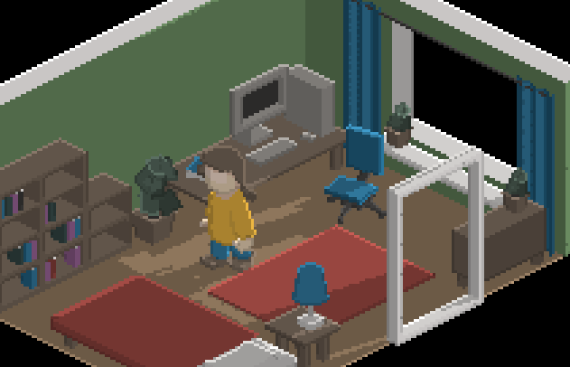

# Raincoat
**Raincoat** is an isometric RPG game in a pixel-art style. It is written in WebGL 2 and uses deferred shading techniques.

(It is a work-in-progress so the screenshot might not be up-to-date.)

## Building From Source
This is an npm-project so you need npm-installed to build it.

Go to the directory where you would like to build the game.

1. `git clone https://github.com/Pyknic/raincoat.git` clones the sources from this repository
2. `cd raincoat`
3. `npm run build`

You can now open `index.html` in a browser and play the game.

## License
The assets of the game (2D-textures, 3D-models, scene files, sounds/music etc.) can be used for non-commercial purposes under the [CC BY-NC-SA 4.0 International License](https://creativecommons.org/licenses/by-nc-sa/4.0/).

The source code of the game that is written by me can be used under the [MIT license](LICENSE.md). The game also uses code from [the following sources](NOTICES.md) (used in accordance with their respective licenses):

* *TWGL* by Gregg Tavares
* *WebGL2 Fundamentals* by Gregg Tavares
* *Base64-ArrayBuffer* by Niklas von Hertzen
* *gl-matrix* by Brandon Jones, Colin MacKenzie IV
